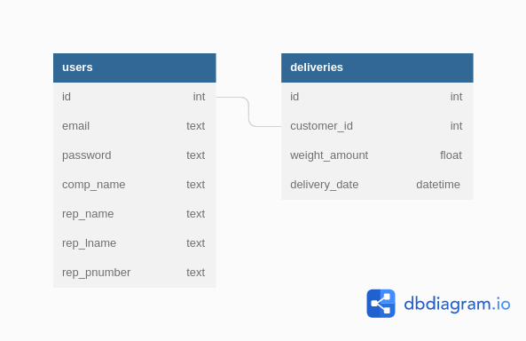

# Team 4 Cool Finland Materials Delivery Scheduling System (Customer Facing)

##   File Structure 

In accordance with Flask, all HTML and Jinja files will be saved in ``` templates/ ``` and rendered with ``` render_template ```. <br>
All Jinja templates are saved with the extension <b>html.jinja</b>. All CSS and JS files will be saved in ```static/``` folder.

## Database Schematic 

